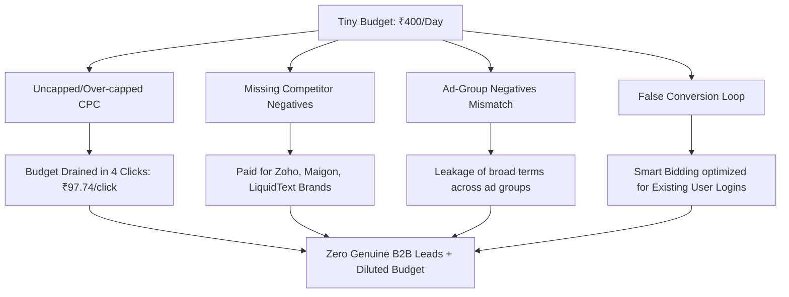
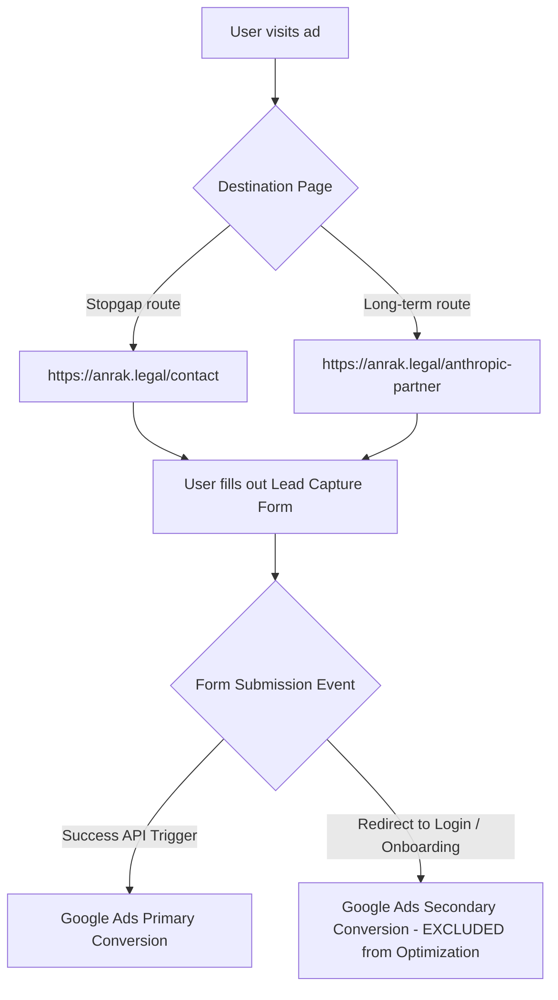

# Audit Council Report: B2B Google Ads Campaign Audit & Setup SOP
**Anrak Legal Campaign Audit & Standard Operating Procedure**

---

## Part 1: Audit Council Debate Transcript
*Date: June 4, 2026*  
*Council Members:*
*   **Member A (Technical SEM Specialist / Operations Director):** Focuses on technical UI configurations, network settings, bidding mechanics, tag installations, and match type behavior.
*   **Member B (B2B Marketing Auditor / Strategy Director):** Focuses on B2B ICP alignment, competitor exclusions, negative keyword coverage, demographic filters, and lead qualification strategy.

---

### Session 1: What Went Right (The Foundational Strides)

**Member A:** Let's look at the transition from Kapil's legacy setup (Campaign 37) to our new B2B campaigns (Campaign 25). First, the positive structural changes. We strictly isolated the campaign to **Google Search Only**. We disabled the **Display Network** and **Search Partners**. In Campaign 37, the Display Network would have eaten our budget with cheap, low-intent accidental clicks on mobile games or junk blogs. For a ₹400/day budget, search-only is the only way to maintain keyword intent density.

**Member B:** Agreed. From a strategic targeting perspective, the consolidation of ad groups in Campaign 25 was correct. We grouped our high-intent keywords under the `Enterprise Legal AI OS` and `Case Management & AI Paralegal` ad groups. In a tiny-budget setup, splitting ₹400/day across multiple campaigns is lethal; none of them would gather enough data to exit Google's learning phase. By keeping them consolidated, we concentrated our budget. Furthermore, we shifted keywords from Broad Match to strict **Exact Match (`[...]`)** and **Phrase Match (`"..."`)**. 

**Member A:** The match type restriction was vital. Kapil’s Campaign 37 ran 100% Broad Match keywords like `ai for legal` and `legal research`. That cast an absurdly wide net, causing us to show up for student queries and personal disputes. In Campaign 25, keywords like `[ai software for law firms]` and `"legal workflow automation"` targeted enterprise search intent. Additionally, we implemented B2B pre-qualification directly in the ad copy. We pinned `"For Law Firms Only - AI OS"` to Position 1 and highlighted our Anthropic co-branding (`"Includes Free Claude Pro"`) in Position 2.

**Member B:** Yes, pinning B2B pre-qualifiers in the headline is a classic strategy to deter unqualified searchers. If a solo practitioner or a student is looking for a cheap contract template, seeing "For Law Firms Only" and "Enterprise+" in the ad copy discourages them from clicking. Since Google Ads charges per click, pre-qualifying copy acts as a free filter.

---

### Session 2: What Went Wrong (The Failures & Dilutions)



**Member B:** Let’s address the core failures. First, the **missing competitor brand negative keywords**. We targeted `"legal workflow automation"` as a Phrase Match keyword, which Google matches semantically to related searches. Because we had no competitor negatives, our ads triggered on competitor brand queries. On June 4, we spent our budget on competitor search terms:
*   `maigon ai` cost us **₹160.46** for 4 clicks.
*   `liquidtext for lawyers india` cost us **₹97.74** for 1 click.
*   `zoho legal case management` cost us **₹53.60** for 1 click.
*   `law central ai` cost us **₹55.34** for 1 click.
*   `draft bot pro` cost us **₹41.69** for 1 click.
Almost 70% of our ad spend on June 4 went to competitor terms because we failed to exclude Harvey, Legora, Zoho, Maigon, LiquidText, and others.

**Member A:** The bidding mechanics made this worse. We set a **Maximum CPC limit of ₹100.00** on a daily budget of **₹400.00**. This CPC cap was far too high. A single click on `liquidtext` cost us **₹97.74**, and a click on `best ai for advocates in india` cost **₹79.86**. When a single click consumes 20% to 25% of your daily budget, the campaign goes dark in the morning after 4 or 5 clicks. We ended up spending **₹693.10** on June 4 (Google is allowed to exceed the daily budget by up to 100% on high-traffic days), but we only got 13 clicks and zero conversions.

**Member B:** We also made an administrative and tactical error by draft-matching **negative keywords at the ad-group level** instead of the campaign level. Negative keywords like `free`, `student`, and `jobs` were applied to the `Enterprise Legal AI OS` ad group but omitted from the `Case Management & AI Paralegal` group. If someone searched "free case management system," it bypassed the negative filter in the case management group, leading to budget leakage. Negatives for a single-offer campaign must be enforced at the Campaign Level.

**Member A:** But the most damaging technical failure was the **false conversion tracking loop on `/onboarding` page-loads**. In Kapil's legacy campaign (Campaign 37), Google Ads reported 2 conversions with a cost-per-conversion of ₹423.84. However, the conversion tag was set to fire on page-loads of `/onboarding`. 
When returning users logged in, they were redirected to `/onboarding`. When our internal engineering team ran tests or logged in, they loaded `/onboarding`. Every time this happened, Google Ads recorded a "conversion." We paid for returning users and internal developers, and Google’s Smart Bidding algorithm optimized itself to find searchers who resembled our existing users logging in, rather than new enterprise leads.

---

### Session 3: Financial & Bidding Impact Analysis

| Campaign Metric | Kapil's Legacy Campaign (Campaign 37) | Rebuilt Campaign (Campaign 25) - Day 1 |
| :--- | :--- | :--- |
| **Date Range** | May 4 – June 2, 2026 | June 4, 2026 |
| **Total Spend** | ₹847.67 | ₹693.10 |
| **Clicks / Impressions** | 141 clicks / 2,129 impressions | 13 clicks / 181 impressions |
| **Average CPC** | ₹6.01 | ₹53.32 |
| **CTR** | 6.62% | 7.18% |
| **Conversions Reported** | 2.00 (False Post-Login Hits) | 0.00 |
| **Genuine Conversions** | 0.00 (Empty lead capture) | 0.00 |
| **Primary Pitfalls** | Broad match keywords, zero B2B negatives | Uncapped/High CPC caps, competitor leaks |

#### The Cost of the Mistakes:
1.  **Budget Dilution (₹1,540.77 wasted):** Between Kapil's campaign and Day 1 of the new campaign, we spent a combined ₹1,540.77. Because of Broad Match in Campaign 37 and missing competitor negatives in Campaign 25, we did not capture a single genuine B2B lead.
2.  **Uncapped Bidding Leakage:** With a ₹100 CPC cap, we paid an average of ₹53.32 per click on June 4. Clicks like ₹97.74 (LiquidText) and ₹79.86 (Advocate AI) are unsustainable for a ₹400/day budget.
3.  **Bidding Algorithm Poisoning:** Because Google Ads optimized for the `/onboarding` page-load, the conversion tag trained Google's system on junk data, rendering automated bid strategies useless until the conversion tag is hardened.

---

### Session 4: Standardizing the Playbook

**Member B:** Moving forward, we must implement a strict pre-launch protocol. We need a competitor brand exclusion list and must mandate that negative keywords are applied campaign-wide.

**Member A:** And technically, we must transition from URL page-load conversion triggers to custom event triggers (such as CSS button clicks or API form-submission successes) to prevent the post-login loop. We must also set our Maximum CPC limits dynamically based on our daily budget to ensure a minimum click density. Let's document this into a standard operating checklist.

---

## Part 2: B2B Google Ads Standard Operating Procedure (SOP) & Checklist

This SOP is a mandatory audit and setup guide. It must be executed **before** any B2B search campaign is pushed live and audited **within the first 24/48/72 hours** of launch.

### 1. Pre-Launch Setup & Settings Audit

#### Campaign Settings Validation
*   [ ] **Campaign Type:** Must be **Search Only**. Ensure Display Network and Search Partners are **unchecked**.
*   [ ] **Location Targeting:** Set strictly to target geographic presence.
    *   *Target:* `India` (or specific target market).
    *   *Location Options:* Expand and select **"Presence: People in or regularly in your targeted locations"**. (Do *not* choose "Presence or interest").
*   [ ] **Languages:** Set to `English` (or the primary business language of your B2B ICP).
*   [ ] **Final URL Expansion:** Must be **OFF** (Deselect "Send traffic to the most relevant URLs on your site"). This prevents Google from bypass-routing traffic to blog posts or random docs.
*   [ ] **Dynamic Search Ads (DSA):** Must be **OFF** (Disabled). Do not supply a domain for automated targeting.

#### Bidding & Budget Caps (The 10-15% Rule)
> [!IMPORTANT]
> **CPC Cap Formula:** The Maximum CPC Cap must be set between **10% and 15% of the Daily Budget**.
> $$\text{Max CPC Cap} = \text{Daily Budget} \times (0.10 \text{ to } 0.15)$$
> For a ₹400/day budget, the Max CPC cap must be set between **₹40.00 and ₹60.00**. This guarantees a minimum click density of **7 to 10 clicks per day**, preventing the budget from being exhausted by 4 expensive clicks.

*   [ ] **Bid Strategy:** Start with **Maximize Clicks** to gather initial traffic data.
*   [ ] **CPC Capping:** Check the box "Set a maximum cost per click limit" and input the calculated cap (e.g., ₹50.00 for a ₹400/day budget).
*   [ ] **Ad Schedule:** Set to business hours only to filter out late-night consumer searches.
    *   *Default B2B Schedule:* `Monday to Friday, 9:00 AM - 6:00 PM IST`.

---

### 2. Keyword Selection & Match Type Hardening

*   [ ] **No Broad Match:** All active keywords must be either **Exact Match `[keyword]`** or **Phrase Match `"keyword"`**. No Broad Match keywords are allowed at launch.
*   [ ] **Keyword Intent Alignment:** Verify that every keyword contains a high-intent B2B signifier:
    *   *Correct:* `[enterprise legal case management software]`, `"ai software for law firms"`, `[law firm matter management software]`.
    *   *Incorrect:* `legal ai`, `case management`, `lawyers`, `ai paralegal`.

---

### 3. Campaign-Level Negative Exclusions

> [!WARNING]
> Negative keywords must **NEVER** be applied at the Ad Group level for standard filters. They must be managed via **Campaign-Level Negative Keyword Lists** to ensure consistent protection across the account.

#### Standard B2B Negative Exclusions List
Create a campaign-level negative list containing the following terms:
```text
free, template, templates, DIY, student, students, internship, internships, jobs, job, career, careers, recruitment, resume, resume template, salary, salaries, how to, course, courses, class, classes, tutorial, tutorials, download, pdf download, book, books, case law finder, mock court, moot court, llb notes, law notes, law school, upsc law, judiciary exam, consumer court case status, court case tracker, divorce, family dispute, personal dispute, retail, cheap
```

#### Competitor Brand Negative List
To prevent semantic keyword matching from displaying ads on competitor brand searches, apply this competitor list as negative keywords:
```text
harvey, harvey ai, legora, maigon, maigon ai, zoho, zoho legal, liquidtext, law central, law central ai, draft bot, draftbot, draft bot pro, casemine, casetext, co counsel, cocounsel, lexisnexis, lexis, manupatra
```

---

### 4. Ad Copy B2B Pre-qualification & Pinning

*   [ ] **Headline 1 (ICP Filter):** Must contain a B2B pre-qualification filter and be **Pinned to Position 1**.
    *   *Examples:* `For Law Firms Only - AI OS`, `Designed for Law Firms`, `Enterprise Legal AI`.
*   [ ] **Headline 2 (Core Offer / Value Hook):** Must highlight the Anthropic partnership hook and be **Pinned to Position 2**.
    *   *Example:* `Includes Free Claude Pro`.
*   [ ] **Headline 3 (Call to Action):** Must feature a direct enterprise CTA and be **Pinned to Position 3**.
    *   *Example:* `Book an Enterprise Demo`.
*   [ ] **Description Pre-qualification:** The description copy must state the enterprise nature of the offering and exclude consumer references.
    *   *Example:* `Built for enterprise law firms. Private-by-design for Indian courts. Schedule a demo.`

---

### 5. Conversion Tracking Hardening Protocol

To prevent post-login loop conversion tags (like `/onboarding` page-loads), implement the following hardening steps:



1.  **Isolate Conversion Triggers:**
    *   **Banned URL Triggers:** Do not trigger primary conversions on pages that can be accessed by authenticated, returning users (e.g., `/onboarding`, `/dashboard`, `/login`, `/index`).
    *   **Mandated URL Triggers:** Use a unique post-submission redirect page that is *only* accessible upon a successful form submission (e.g., `/contact-thank-you` or `/demo-scheduled`).
2.  **Implement Event-Based Triggers:**
    *   Instead of tracking page-loads, configure Google Tag Manager (GTM) or gtag.js to listen to form submission success events:
    ```javascript
    // Example form submission tracking handler
    document.querySelector('#b2b-lead-form').addEventListener('submit', function(event) {
        // Only trigger conversion if the submission is verified and processed
        if (formSubmissionIsSuccessful) {
            gtag('event', 'conversion', {
                'send_to': 'AW-XXXXXXXXX/YYYYYYYYYYYYYY',
                'value': 1000.00,
                'currency': 'INR'
            });
        }
    });
    ```
3.  **Differentiate Primary vs. Secondary Actions:**
    *   Set the **Demo Form Submission** or **Contact Request** as the **Primary Action** (used for bidding optimization).
    *   Set any account sign-ins, page views, or trial token activations as **Secondary Actions** (observed for monitoring only, excluded from bidding optimization).

---

### 6. Post-Launch Optimization Windows (Ongoing Audit)

#### The 24-Hour Check (Immediate Hygiene)
*   **Search Terms Audit:** Open the Search Terms Report. Identify any broad terms or unrecognized competitor queries. Add them to the campaign-level negative keyword list immediately.
*   **CPC Cap Check:** Verify the average CPC. If the CPC is near or exceeding our Max CPC cap, verify that the cap was entered correctly and that we are receiving impressions.

#### The 48-Hour Check (Budget Optimization)
*   **Keyword Spend Evaluation:** If any individual keyword has spent more than **50% of the daily budget** (₹200) without generating a lead or demo request, **pause it immediately**.
*   **Impression Share Analysis:** Check the Search Lost IS (budget) and Search Lost IS (rank). If we are losing significant share due to budget, verify if the CPC cap is too high.

#### The 72-Hour Check (Demographic & Schedule Polish)
*   **Ad Schedule Verification:** Confirm that ads are only running during the specified B2B hours (`Mon-Fri, 9:00 AM - 6:00 PM IST`).
*   **Age Demographic Exclusions:** Audit the demographics tab. Since our target audience consists of senior associates, partners, and legal executives, exclude the **18-24 age bracket** to prevent student clicks.

#### Weekly Account Health Check
*   **Conversion Tag Audit:** Run a Google Tag Assistant diagnostic. Ensure that no conversions have been recorded from duplicate IP addresses or returning users loading `/onboarding`.
*   **Lead Quality Loop:** Cross-reference lead forms captured in the CRM with Google Ads click timestamps to verify lead quality.
